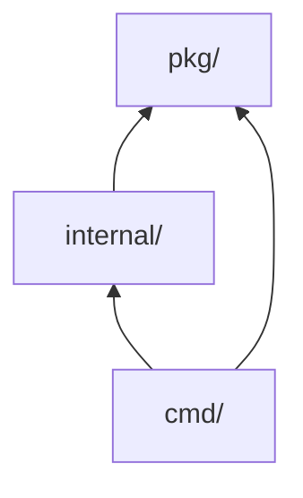
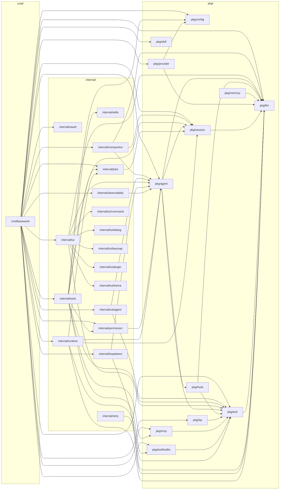

# 模块依赖图（自动生成）

> 本文件由 `make deps` 自动生成，请勿手工编辑。
> 修改代码后重新运行 `make deps` 刷新即可；CI 会校验生成物是否与代码一致。

## 统计口径

| 项 | 口径 |
|---|---|
| 扫描范围 | `pkg/`、`internal/`、`cmd/` 下的目录 |
| 包判定 | 目录内含至少一个非测试 `.go` 文件 |
| 依赖边 | 同一包内非测试 `.go` 文件的 import，去重 |
| 标准库 | 导入路径首段不含 `.`（如 `net/http`），不计入依赖 |
| 构建约束 | 从 `//go:build` 读取，用于判断第三方依赖是否参与默认构建 |
| 排序 | 全部按字典序，保证输出确定性（CI 需要 `git diff --exit-code`） |
| 时间戳 | 刻意不输出，否则新鲜度门禁将永久失败 |

## 层级概览

| 层级 | 包数 | 非测试 .go 文件 | 定位 |
|---|---|---|---|
| `pkg/` | 12 | 114 | 可嵌入核心（稳定 API，不得依赖上层） |
| `internal/` | 17 | 100 | 终端产品专用逻辑（无兼容性承诺） |
| `cmd/` | 1 | 23 | 可执行入口 |

## 层级依赖图

依赖方向为「上层 → 下层」。`pkg/` 不得指回 `internal/` 或 `cmd/`，
该约束由 `tests/arch_test.go` 守护（见「层级违规检测」）。

## 包级依赖图

## 依赖边清单

| 包 | 依赖 |
|---|---|
| `cmd/basework` | `internal/compaction`、`internal/jobs`、`internal/loopdetect`、`internal/oauth`、`internal/observability`、`internal/permission`、`internal/runtime`、`internal/subagent`、`internal/tools`、`internal/tui`、`pkg/agent`、`pkg/config`、`pkg/llm`、`pkg/lsp`、`pkg/mcp`、`pkg/provider`、`pkg/session`、`pkg/skill`、`pkg/tool`、`pkg/tool/builtin` |
| `internal/compaction` | `pkg/agent`、`pkg/llm`、`pkg/session` |
| `internal/jobs` | `pkg/session` |
| `internal/loopdetect` | `pkg/agent`、`pkg/llm` |
| `internal/observability` | `pkg/agent` |
| `internal/permission` | `pkg/agent` |
| `internal/retry` | `pkg/llm` |
| `internal/runtime` | `internal/jobs`、`pkg/agent`、`pkg/llm`、`pkg/session`、`pkg/tool` |
| `internal/subagent` | `pkg/agent`、`pkg/tool` |
| `internal/tools` | `internal/edits`、`internal/jobs`、`internal/permission`、`pkg/config`、`pkg/mcp`、`pkg/session`、`pkg/tool`、`pkg/tool/builtin` |
| `internal/tui` | `internal/tui/command`、`internal/tui/dialog`、`internal/tui/keymap`、`internal/tui/plugin`、`internal/tui/theme`、`pkg/agent`、`pkg/llm`、`pkg/tool` |
| `pkg/agent` | `pkg/hook`、`pkg/llm`、`pkg/session`、`pkg/tool` |
| `pkg/hook` | `pkg/llm`、`pkg/tool` |
| `pkg/lsp` | `pkg/tool` |
| `pkg/mcp` | `pkg/tool` |
| `pkg/memory` | `pkg/llm` |
| `pkg/provider` | `pkg/config`、`pkg/llm` |
| `pkg/session` | `pkg/llm` |
| `pkg/tool` | `pkg/llm` |
| `pkg/tool/builtin` | `pkg/tool` |
| `internal/edits` | （无模块内依赖） |
| `internal/oauth` | （无模块内依赖） |
| `internal/tui/command` | （无模块内依赖） |
| `internal/tui/dialog` | （无模块内依赖） |
| `internal/tui/keymap` | （无模块内依赖） |
| `internal/tui/plugin` | （无模块内依赖） |
| `internal/tui/theme` | （无模块内依赖） |
| `pkg/config` | （无模块内依赖） |
| `pkg/llm` | （无模块内依赖） |
| `pkg/skill` | （无模块内依赖） |

## 扇入 / 扇出

扇入（有多少个包依赖它）高的包是「改动影响面最大」的包，重构时应优先关注
其兼容性承诺；扇出则反映一个包的依赖复杂度。

### 扇入 Top（被依赖最多）

| 包 | 计数 |
|---|---|
| `pkg/llm` | 12 |
| `pkg/tool` | 10 |
| `pkg/agent` | 8 |
| `pkg/session` | 6 |
| `internal/jobs` | 3 |
| `pkg/config` | 3 |
| `internal/permission` | 2 |
| `pkg/mcp` | 2 |
| `pkg/tool/builtin` | 2 |
| `internal/compaction` | 1 |
| `internal/edits` | 1 |
| `internal/loopdetect` | 1 |

（共 27 个包有非零计数，此处仅列前 12）

### 扇出 Top（依赖最多）

| 包 | 计数 |
|---|---|
| `cmd/basework` | 20 |
| `internal/tools` | 8 |
| `internal/tui` | 8 |
| `internal/runtime` | 5 |
| `pkg/agent` | 4 |
| `internal/compaction` | 3 |
| `internal/loopdetect` | 2 |
| `internal/subagent` | 2 |
| `pkg/hook` | 2 |
| `pkg/provider` | 2 |
| `internal/jobs` | 1 |
| `internal/observability` | 1 |

（共 20 个包有非零计数，此处仅列前 12）

## 层级违规检测

✅ 未发现层级或依赖边界违规。

## pkg/ 层第三方依赖明细

用于核对 docs/ARCHITECTURE.md 的依赖策略声明。构建约束为空表示该依赖在**默认构建**
（不带 build tag）下即被引入；否则仅在使用对应 tag 时引入。

| 包 | 第三方依赖 | 构建约束 | 白名单 |
|---|---|---|---|
| `pkg/llm` | `golang.org/x/image/draw` | 默认构建 | ✅ |
| `pkg/llm` | `golang.org/x/image/webp` | 默认构建 | ✅ |
| `pkg/memory` | `modernc.org/sqlite` | `memory` | ✅ |
| `pkg/provider` | `golang.org/x/oauth2` | 默认构建 | ✅ |
| `pkg/session` | `github.com/golang/snappy` | `sqlite` | ✅ |
| `pkg/session` | `modernc.org/sqlite` | `sqlite` | ✅ |
