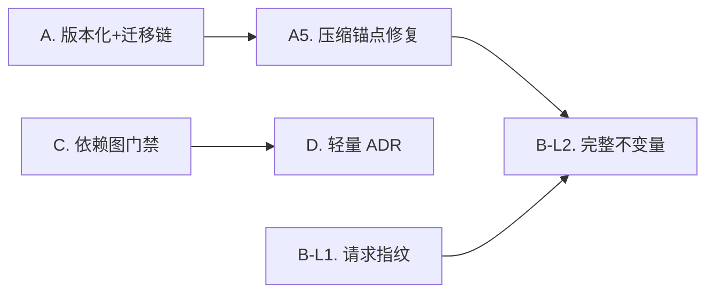

> 历史归档（2026-09-12）：保留迁移前正文与历史判断，链接已迁移。状态、代码片段、数量和待办可能过时；不得据此领取任务或判定完成。当前入口见 [文档中心](../README.md)。

# 借鉴 dsh 优化 basework — 改造方案

> 状态：**已执行（A + C + D + B + E）**，2026-09-12
> 提出日期：2026-09-12
> 上游分析：`docs/analysis/deepseek-harness-vs-basework.md`
> 范围：数据安全（会话格式版本化 + 迁移链）+ 制度（模块依赖图门禁 + 轻量 ADR）
> 　　　+ 不变量（"模型可见即已记录"）+ 契约文档（`pkg/` 包 README）
> 执行结论与偏差见 §7（第一轮 A/C/D 见 §7.1–7.4，第二轮 B/E 见 §7.5）

---

## 0. 一句话结论

basework 的**事件溯源地基比之前报告里写的更完整**——`pkg/agent/loop.go:89` 的 `History()`
已经是 `ProjectMessages(session.Events())`，事件日志确实是消息历史的唯一来源。
真正缺的不是机制，是**"强制"与"版本"**：没有格式版本号、没有迁移链、没有任何东西
保证真正发给 provider 的 messages 等于日志的投影。

因此本方案的重心是**给已有地基加护栏**，而不是新建一套架构。

---

## 1. 侦察结论（含对既有认知的修正）

### 1.1 已经有的（不需要重建）

| 能力 | 证据 |
|---|---|
| 事件类型族 | `pkg/session/event.go:15-40`，12 种 `EventType` |
| 事件 → 消息投影 | `pkg/session/projection.go:20` `ProjectMessages` |
| 历史 = 投影 | `pkg/agent/loop.go:89-95` `History()` = `ProjectMessages(Events())` |
| 用户输入已落盘 | `pkg/agent/loop.go:176` 写 `EventPrompted` |
| 工具调用/结果已落盘 | `ToolCalled/ToolSuccess/ToolFailed` |
| 压缩已落盘 | `pkg/agent/loop.go:330-339` 写 `EventCompacted` |
| LLM 请求钩子 | `pkg/agent/observer.go:14` `Observer.OnLLMRequest` |
| 架构边界守护 | `tests/pkg_no_internal_test.go`（本轮新增） |

**结论：地基可用，dsh 那条 "model-visible means logged" 的骨架你已经有了。**

### 1.2 真正缺的（本方案要补）

| # | 缺口 | 证据 | 性质 |
|---|---|---|---|
| G1 | 事件无格式版本号 | `Event` 结构（`event.go:43-50`）无版本字段；JSONL 无 header 行 | 数据安全 |
| G2 | SQLite 无 schema 版本 | `pkg/session/sqlite.go:68` schema 无 `user_version` / meta 表 | 数据安全 |
| G3 | 无迁移机制 | `pkg/session/` 下无任何 migrate/upgrade 代码 | 数据安全 |
| G4 | 压缩锚点是**位置**不是**序号** | `loop.go:330` 只写 `KeepFrom`，`projection.go:47` 按 `msgs[KeepFrom:]` 截断；`CompactedData.TruncatedSeq` 字段存在但从未被赋值 | 数据安全（隐患） |
| G5 | 压缩摘要被丢弃 | `internal/compaction` 有完整 `SummarizationStrategy`，但 `loop.go:330` 构造 `CompactedData` 时 `Summary` 留空 | 功能缺陷 |
| G6 | system prompt 未落盘 | `pkg/agent/pipeline.go:63-80` 从 `cfg.systemPrompt` 注入；恢复历史会话时用的是**当前配置**的 prompt，不是当初那份 | 不可复现 |
| G7 | steering 消息未落盘 | `pkg/agent/steering.go:78` `Drain()` 消费即丢；`pipeline.go:83-95` 注入后 `p.steeringMsgs = nil` | 不可复现 |
| G8 | 无模块依赖图与新鲜度门禁 | `docs/` 无依赖图；CI 只查格式/vet/边界/测试 | 制度 |
| G9 | 无架构决策留痕 | `openspec/` 已删，`docs/adr/` 不存在 | 制度 |

> **G4 + G5 是本轮侦察新发现的、此前报告未提及的真实缺陷。** G4 值得单独说明：
> 用位置索引 `KeepFrom` 做投影锚点，一旦投影规则变化（例如新增事件类型改变了消息条数），
> 同一份日志在不同版本下会投影出**不同的历史**——历史会话静默错解。dsh 用的是
> `truncated_seq`（事件序号），是稳定锚点。

### 1.3 请求组装的四条漂移路径（为 §5 可选方案铺垫）

`pkg/agent/pipeline.go` 的实际流程：

```
Events() ──ProjectMessages──► msgs
   │
   ├─[漂移1]─ setupTurn:63-80   注入/替换 system prompt（来自 cfg，不入日志）
   ├─[漂移2]─ setupTurn:83-95   前插 steering 消息（Drain 后即丢，不入日志）
   ├─[漂移3]─ callLLM:106       RunBeforeLLM hooks 可任意重写 msgs
   └─[漂移4]─ loop.go:322-345   压缩以 Compacted 事件形式入日志（✓ 已落盘，但锚点脆弱）
                          ▼
              callLLM:113  Model().Stream(&llm.Request{Messages: msgs, ...})
```

`Observer.OnLLMRequest`（`observer.go:26`，由 `RunBeforeLLM` 在 `pipeline.go:106` 触发）
**已经位于最终请求组装完成之后、`Stream` 调用之前**——这就是断言落点，无需新增钩子。

---

## 2. 方案 A — 会话格式版本化 + 相邻迁移链（数据安全）

**目标**：任何时刻读到的会话文件，都能被明确判定为"哪个格式版本"，并能无损升级到当前版本；
遇到未来版本时**拒绝写入并明确报错**，而不是静默错解。

### A1. 事件级版本号

- 文件：`pkg/session/event.go`
- 改动：`Event` 增加字段
  ```go
  // SchemaVersion 是该事件写入时使用的格式版本。
  // 0 或缺省表示 v0（历史数据，无版本字段）。
  SchemaVersion int `json:"v,omitempty"`
  ```
  新增常量 `const SchemaVersion = 1`（当前版本）。
- **兼容性**：`omitempty` + 零值语义 = v0 → **零破坏**。旧文件读出 `SchemaVersion == 0`。
- 影响函数：`EncodeData`/`DecodeData`（`event.go:99/108`）不需要改，但需在
  `DecodeData` 的 `default` 分支加未知类型告警（当前静默返回 nil）。

### A2. JSONL 文件头

- 文件：`pkg/session/jsonl.go`
- 改动：`Create()`（`:144`）写首行 header，`readEvents()`（`:325`）/`loadSession()`（`:271`）识别并跳过
  ```json
  {"_schema":"basework.session","v":1,"created_at":"..."}
  ```
  读取端规则：首行含 `"_schema"` 即视为 header；**不含则是 v0 老文件**（首行必为事件）。
- 影响函数：`AppendEvent:50`、`Events:108`、`readEvents:325`、`loadSession:271`、`Messages:264`
- 迁移：`readEvents` 读出 `v < SchemaVersion` 时调用 `migrateEvent`（见 A4）

### A3. SQLite schema 版本

- 文件：`pkg/session/sqlite.go`（schema 在 `:68`）
- 改动：新库 `PRAGMA user_version = 1`；打开时读 `user_version` 决定是否需要迁移。
  已有库 `user_version == 0` → 视为 v0，跑迁移后置 1。
- 说明：`PRAGMA user_version` 是 SQLite 原生机制，无需新建 meta 表。

### A4. 相邻迁移链

- 新文件：`pkg/session/migrate.go`
- 设计（对齐 dsh 的做法，但用 Go 的写法）：
  ```go
  type migration struct {
      From, To int
      Apply    func(raw []byte) ([]byte, error)   // JSONL：逐行转换
  }
  var migrations = []migration{ /* v0→v1, v1→v2, ... */ }
  // Migrate 只允许相邻步进，不允许跳跃
  func Migrate(from int, to int, fn func(step migration) error) error
  ```
- **硬规则**：只做**相邻**迁移（v0→v1→v2），不做跨版本直达——跨版本一步到位是 dsh 明确
  避免的坑，理由是可测试性：N 个相邻步骤只需 N 个测试，全组合需要 N²。
- 新文件：`pkg/session/migrate_test.go` — 链式迁移测试 + **未来版本拒绝**测试
- 拒绝策略：读到 `v > SchemaVersion` → 返回 `ErrSchemaTooNew`，只读模式可看，
  写入路径（`AppendEvent`）**必须失败**，不得静默降级。

### A5. 修复压缩锚点（G4 + G5）

- 文件：`pkg/agent/loop.go:330`、`pkg/session/projection.go:41-49`
- 改动 1（锚点稳定化）：`loop.go` 写入时同时填 `TruncatedSeq`（取被截断处前一个事件的 `Seq`），
  `projection.go` 优先用 `TruncatedSeq` 定位；`KeepFrom` 保留为 v0 兼容回退路径。
- 改动 2（摘要不再丢弃）：把压缩产生的摘要文本填入 `CompactedData.Summary`，
  `projection.go` 在截断后把摘要作为一条 `system` 或 `assistant` 消息插回列表头部，
  否则"压缩"实际等于"直接丢消息"，模型不知道被丢了什么。
  → `internal/compaction` 的 `SummarizationStrategy.Compact` 目前把摘要塞在返回的 messages 里，
  需要改成同时回传摘要字符串（`Compact()` 签名或新增返回值），这是**破坏性改动**，
  目标 v0.2.0。

### 验收（方案 A）

```bash
# 1. 老文件（无 header / v 字段）可读，且自动升级后字节可比较
go test ./pkg/session/ -run TestMigrateV0ToV1 -v
# 2. 未来版本被拒绝
go test ./pkg/session/ -run TestSchemaTooNewRejected -v
# 3. 压缩锚点跨版本稳定：同一日志在 v0 与 v1 投影结果一致
go test ./pkg/session/ -run TestProjectionStableAcrossSchema -v
# 4. SQLite user_version 正确升级
go test ./pkg/session/ -run TestSQLiteUserVersionUpgrade -v
```

**风险**
- 中：`readEvents` 是热路径（每个会话每次读都过），header 判定必须 O(1)、不能额外全文件扫描。
- 中：A5 摘要改动触及 `internal/compaction` 接口，需要同步 `compact_test.go`。
- 低：`omitempty` 版本字段对现有测试无影响。

---

## 3. 方案 C — 模块依赖图 + 新鲜度门禁（制度）

**目标**：把"文档描述的结构"变成"CI 卡住的结构"，治的是本项目已发生过的病
（手写数字漂移 45%、两份互斥 ROADMAP）。

### C1. 依赖图生成器

- 新文件：`scripts/gendeps/main.go`（纯标准库，与 `scripts/docstats` 同风格）
- 实现：`go/parser` 读 `ImportsOnly`，遍历 `pkg/`、`internal/`、`cmd/`，输出
  `docs/DEPGRAPH.md`——包含 mermaid 依赖图 + 「谁依赖谁」矩阵 + 层级违规检测
- 输出必须**确定性排序**（按 import path 字典序），否则 CI diff 会因顺序抖动而误报
- Makefile 新增：
  ```make
  deps:
  	go run ./scripts/gendeps
  ```

### C2. 新鲜度门禁

- 文件：`.github/workflows/build.yml`（`quality` job）
- 新增步骤（放在 `Check architecture boundaries` 之后）：
  ```yaml
  - name: Check generated docs are fresh
    run: |
      go run ./scripts/gendeps
      go run ./scripts/docstats
      git diff --exit-code docs/DEPGRAPH.md docs/STATS.md
  ```
- 语义：**生成物与提交版本不一致即失败**。改代码必须同步重跑 `make deps stats`。

### C3. 层级规则显式化（复用 C1 的解析结果）

- 文件：`tests/pkg_no_internal_test.go` 扩展为 `tests/arch_test.go`
- 新增规则：
  - `pkg/` 不得 import `internal/`、`cmd/`（已有）
  - `internal/` 不得 import `cmd/`
  - 接口注入白名单：`pkg/` 内允许 `Set*` 注入的接口必须登记在表里
    （现有 3 处：`builtin.SetPathChecker`、`builtin.SetEventBus`、`builtin.SetTimeoutConfig`）

### 验收（方案 C）

```bash
make deps                      # 生成 docs/DEPGRAPH.md
# 故意在 pkg/llm 加一行 import internal/permission → tests 包报违规
go test ./tests/ -run TestArch -v
# 改代码不重跑 gendeps → CI 的 freshness 步骤失败（本地可模拟）
```

**风险**
- 低：纯新增，不动运行时代码。
- 低：mermaid 图在 GitHub 与本地渲染差异——只做文本级 diff，不做渲染校验。

---

## 4. 方案 D — 轻量 ADR（制度）

**目标**：补上决策留痕。`openspec/` 已删（160 文件、流程重），但留痕不能一起删掉。

### D1. 目录与模板

- 新文件：`docs/adr/TEMPLATE.md`
- 新文件：`docs/adr/0001-record-architecture-decisions.md`（自举，记录"我们决定用 ADR"）
- 命名：`NNNN-kebab-title.md`，四位序号，状态字段 `Status: Proposed | Accepted | Superseded by NNNN`
- 强制三节：`## 背景` / `## 决定` / `## 后果`——**只写这三节**，不做流程、不做审批链

### D2. 校验合并进一个脚本

- 新文件：`scripts/doccheck/main.go`（纯标准库）
- 校验项：
  1. `docs/adr/**` 文件名格式 + 三节齐备 + `Status` 合法
  2. 全仓 markdown 相对链接有效性（把本轮临时用的 Python 脚本固化下来）
- Makefile：`check-docs: go run ./scripts/doccheck`
- CI：`quality` job 新增 `Check docs` 步骤

### D3. 回填两条已发生的决策

- `0002-decouple-pkg-from-internal.md` — 记录反向依赖的判定标准与否决过的替代方案
- `0003-merge-roadmaps-single-source.md` — 记录"为什么文档要单一权威 + 数字必须机器生成"

> D3 是可选增值项，价值在于让 ADR 目录一开始就有真实内容，而不是空模板。

### 验收（方案 D）

```bash
make check-docs      # 全绿
# 故意删掉某 ADR 的「## 后果」节 → doccheck 报错
# 故意写一个指向不存在文件的相对链接（例如 `nope.md`）→ doccheck 报错
```

**风险**：低。唯一需要注意的是别把 ADR 做成第二个 openspec——所以模板只允许三节。

---

## 5. 追加项（B / E — 2026-09-12 已执行）

### B. "model-visible means logged" 不变量

分两级，成本差一个数量级：

**B-Level 1（低成本，推荐先做）— 请求可审计**
- 在 `pipeline.go:113` 之前新增事件 `EventRequestBuilt`，记录
  `{v, msg_count, tool_count, hash, derived_sources[]}`
- 语义：每个真正发给 provider 的请求都在日志里留下指纹，可事后核对
- 影响：`pkg/session/event.go` 新增事件类型 + `projection.go:137` 加空分支（不投影为消息）
- 估算：~200 行

**B-Level 2（完整）— 请求可重建 + strict 断言**
- 前置动作：把 G6（system prompt）与 G7（steering）**落成事件**
  - 新增 `EventSystemPromptSet`、`EventSteered`
  - `projection.go` 支持从这两类事件投影出对应的 system 消息
- 然后断言才可能成立：`final_msgs == ProjectMessages(events)`（在 hooks 不改写的前提下）
- **B-Level 2 强依赖方案 A**——新增事件类型会改变 `ProjectMessages` 的输出，
  没有版本号与迁移链就上线，等于让历史会话静默错解。这是排序上不可颠倒的约束。
- 估算：~350 行（含 API 兼容处理，目标 v0.2.0）

**为什么值钱**：它把「流式组装 / 压缩 / subagent / steering」四条路径的静默漂移
变成显式失败。当前这四条路径都可能悄悄改变实际请求而不留痕。

**执行结果（L1 + L2 均落地）**：

| 项 | 落地形式 |
|---|---|
| L1 请求指纹 | `session.EventRequestBuilt`（`msg_count` / `tool_count` / `hash` / `sources`），在 `RunBeforeLLM` 之后、`Model().Stream` 之前写入 |
| L2 请求可重建 | 新增 `EventSystemPromptSet`、`EventSteered`；`agent.BuildRequestMessages(events)` 成为请求的唯一组装入口；`pipeline.setupTurn` 不再从 cfg 直注 system prompt、不再用内存态 steering 队列 |
| strict 断言 | `agent.CheckRequestInvariant(events, actual)` + `pkg/agent/request_invariant_test.go` 的逐轮校验 |

**执行中修正的两处设计**（详见 §7.5）：

1. **`ProjectMessages` 不投影这三类新事件。** 原方案设想「`projection.go` 支持从这两类
   事件投影出对应的 system 消息」，使断言写成 `final_msgs == ProjectMessages(events)`。
   实测这样做会同时破坏两件事：Session 级上下文的事件 Seq 必然大于其后全部历史，
   插到列表头部会让 `seqs` 变**非单调**（压缩锚点定位依赖单调性）；而 system 消息必须
   在列表最前、压缩又只截断尾部，两者叠加会让压缩把 system prompt 一并丢掉。
   因此改为把「请求 = 事件日志的纯函数」落在 agent 层的 `BuildRequestMessages`，
   投影层保持原样。断言随之写成 `final_msgs == BuildRequestMessages(events)`。
2. **仍需升 `SchemaVersion` 到 2。** 投影结果没变，所以原方案给的理由（"会改变
   `ProjectMessages` 的输出"）不成立；但旧版本程序会忽略这三类事件、改用配置里的
   system prompt，从而构造出与写入方意图不同的请求且不报错。版本号在这里是**能力门槛**，
   v1→v2 是纯版本戳（无数据变换）。

### E. `pkg/` 包 README 契约

- 现状：`pkg/ internal/ cmd/` 下 **0 个 README**（`find` 实测）
- 内容：12 个 `pkg/` 包，每包四节——用途 / 配置 / 扩展点 / Known Limitations
- 配套：把契约检查并入 `scripts/doccheck`
- 估算：文档为主，~12 个文件
- 判断：`pkg/` 是"可嵌入库"定位的核心资产，值得做，但属于内容工作量，
  建议独立成一轮，不要和 A/C/D 混在一起。

**执行结果**：

- 12 个 `pkg` 下的 Go 包全部补齐 README（`pkg` 根目录只有集成测试、`pkg/agent/templates`
  无 Go 文件，按「目录下有非 `_test.go` 的 `.go` 文件」判定自动排除，不维护手写清单）。
- 契约并入 `scripts/doccheck`：缺 README 或四节不全即非零退出；并加了假阴性防护
  （扫到 0 个包时判定"检查未生效"而不是通过）。
- 双向验证：去掉某包一节 → 被拒；删掉某包 README → 被拒；恢复后通过。
- 写 README 的过程中修掉一处自己的错误断言：初稿称 `skill.Loader.Discover()` 「返回整体
  错误」，实际是**只打日志、静默跳过**；又称内置 skill 来自「二进制内嵌资源」，
  实际 `Builtin` 的判定依据是**路径位置**（非第一个路径即为内置）。两条都已按代码更正
  ——这正是这个契约想拦住的那类失真。

### 明确不做

| 不做 | 理由 |
|---|---|
| 运行时插件热挂载 | Go 无此能力；会摧毁"单二进制 / 可嵌入"这个真护城河 |
| Web / Electron / SDK 多端 | dsh 的主场，不是 basework 的战场 |
| 298 包级拆分 | 当前 30 个包是合理粒度，拆细只增负担 |
| 重开 openspec 那类流程 | 流程重是本项目已删它的原因；用 ADR 替代 |

---

## 6. 实施顺序与工作量



| 批次 | 内容 | 估算 | 破坏性 |
|---|---|---|---|
| 第 1 批 | A1 → A2 → A3 → A4 | ~750 行 | 零破坏 |
| 第 2 批 | A5（锚点 + 摘要） | ~430 行 | 仅 `internal/`，对外零破坏（原估 v0.2.0） |
| 第 3 批 | C1 → C2 → C3 | ~350 行 | 零破坏 |
| 第 4 批 | D1 → D2 → D3 | ~250 行 | 零破坏 |

**建议先做第 3、4 批（C + D）**——零破坏、独立、能立刻生效；再做第 1 批（A，数据安全）；
第 2 批（A5）涉及 `internal/compaction` 接口，作为 v0.2.0 的 breaking 项集中处理。

> 执行后修正：第 2 批实际**没有产生对外破坏**。`agent.Compactor` 通过新增可选接口
> `CompactReporter` 保持兼容；`compaction.Strategy` 的签名变化发生在 `internal/` 下，
> 按本项目兼容性策略无对外承诺。详见 §7.1 第 2 条。

B 与 E 在第二轮单独授权后执行（见 §5 与 §7.5），因此实际交付为 **A + C + D + B + E**。

---

## 7. 执行结果与偏差记录

**范围**：第一轮 A1–A5 + C1–C3 + D1–D3；第二轮（单独授权）B + E。至此 §5 全部落地。

### 7.1 与原计划的四处偏差（均为执行中发现的问题）

| # | 原计划 | 实际执行 | 原因 |
|---|---|---|---|
| 1 | C2 用 `git diff --exit-code docs/STATS.md` 做新鲜度门禁 | **先移除 `docstats` 生成的时间戳**，否则门禁必然永久失败 | 生成物含时间戳 ⇒ 每次生成都不同 ⇒ 比对永远失败。已同时把「不输出时间戳、全部字典序排序」写入两个生成器的文件头注释 |
| 2 | A5 需**破坏** `agent.Compactor` 签名，目标 v0.2.0 | **未破坏**：新增可选扩展接口 `agent.CompactReporter` | Go 接口结构化满足；已实现 `Compactor` 的嵌入方无需改动。只有 `internal/compaction` 的 `Strategy` 签名变了，而它在 `internal/` 下无对外承诺 |
| 3 | 摘要角色在 `system` / `assistant` 间二选一 | 选 **`user`** | `system` 会被 `pipeline.setupTurn` 的「替换首条 system 消息」逻辑静默吃掉；`assistant` 会让模型误以为摘要出自它自己。与 `internal/compaction` 既有约定一致 |
| 4 | gendeps 只输出到文档 | 发现违规时**以非零退出** | 若只把 ❌ 写进文档，把带违规的文档提交进仓库就能让新鲜度门禁通过 |

### 7.2 执行中新发现的问题（原计划未预见）

- **摘要消息的锚点不能用压缩事件的 Seq**（A5 实现期发现）。摘要代表「被丢弃的那段
  历史」，若用压缩事件自身的 Seq（必然晚于其后保留的消息），`seqs` 会变成非单调序列，
  下一次压缩定位锚点时错误命中该摘要，导致整段历史被保留、两份摘要叠加。已改为取
  截断边界 `TruncatedSeq`，并补了 `TestProjectionSecondCompactionSupersedesFirst`。
- **JSONL 读取的 scanner 上限**：`bufio.Scanner` 默认 64KB，单条携带长工具输出的事件会
  直接报 `token too long`。已提升到 16MB。
- **`ARCHITECTURE.md` 的依赖声明两次失实**：先称「`pkg/` 不依赖任何第三方库」，改后又称
  「唯一例外是 `golang.org/x/image`」——实际有 4 个。这是 C1 上线后暴露的第一条结构性
  失实，已改为与 `docs/DEPGRAPH.md` 一致的清单，并把「`golang.org/x/image` 与
  `golang.org/x/oauth2` 未做 build tag 隔离」记为已知偏差。
- **覆盖率数字不可复现**（收尾阶段跑三连验证时发现，属 C2 门禁的直接产出）。原计划
  C2 门禁比对的 `docs/STATS.md` 里含每包覆盖率。实测同代码重复测量：`pkg/lsp` 在
  84.9%–85.5% 之间抖（跨度 0.6%），`pkg/mcp` 在 87.2%–87.4% 之间抖。成因是含并发的包
  （lsp 的 JSON-RPC server、mcp 的子进程客户端）在语句覆盖计数上存在调度相关的不确定性，
  与 Go 版本无关，**任何小数精度都不能稳定**。已把 `make stats` 固定为 `-no-cover`，
  `docs/STATS.md` 只保留确定性指标（行数、文件数、用例数），覆盖率另设 `make coverage`
  （仅打印、不写文件、不入门禁）。此条修正后两次生成的哈希才稳定一致。

### 7.3 原计划的四个待拍板问题，最终答案

1. **范围**：第一轮 A + C + D，B / E 暂不动；**第二轮单独授权后 B + E 也已落地**。✅
2. **A5 摘要角色**：`user`（理由见 7.1 第 3 条）。
3. **C2 门禁严格度**：直接上 CI 硬失败。误报源已在生成器层面掐掉——时间戳移除、
   全程字典序排序、**覆盖率排除**（见 7.2 末条，实测不可复现）。生成物经三连运行哈希
   比对确认完全一致，不需要「先本地观察」。
4. **ADR 序号起点**：`0001` 自举（记录「为何弃 openspec 改用 ADR」）。这条并非仪式性
   记录——它解释了同一个仓库里为什么删掉了一个文档制度又新建了另一个。

### 7.5 第二轮（B + E）执行结果与偏差

| # | 原计划 | 实际执行 | 原因 |
|---|---|---|---|
| 1 | 让 `ProjectMessages` 直接投影出 system / steering 消息，断言写成 `final_msgs == ProjectMessages(events)` | **投影层不动**，改为 agent 层 `BuildRequestMessages(events)`，断言写成 `final_msgs == BuildRequestMessages(events)` | 会同时破坏两件事：Session 级上下文的 Seq 必然大于其后所有历史，插到头部让 `seqs` 非单调（压缩锚点依赖单调性）；且 system 消息必须在最前而压缩只截断尾部，叠加后压缩可能把 system prompt 丢掉 |
| 2 | 升 `SchemaVersion` 的理由是「新增事件类型会改变 `ProjectMessages` 的输出」 | 仍然升到 v2，但理由是**能力门槛**：旧版本会忽略新事件、改用配置，构造出与写入方意图不同的请求且不报错 | 投影输出确实没变，原理由不成立；但「静默构造出另一个请求」正是版本号要挡的情形。v1→v2 为纯版本戳 |
| 3 | steering 未说明在请求中的位置是否延续 | 延续原行为：system prompt → steering → 历史 | 位置一变会波及既有 `TestSteeringIntegration`；且 system 消息落在对话中间多数 provider 会拒收 |
| 4 | 未预见 | **`RequestFingerprint` 对 `nil` 与空切片给出不同哈希** | `json.Marshal` 把 nil 切片写成 `null`、空切片写成 `[]`。已加归一化；这是测试发现的真缺陷，不是测试写错 |
| 5 | 未预见 | 单轮校验不能拿**最终日志**比对——请求发出后 assistant 回复还会继续落盘 | 已改为按 `request.built` 事件的 Seq 把日志截回「那一刻」，并补了 `TestRequestInvariant_RequestPrecedesAssistantReply` 固定这一时序 |

E 的偏差记录见 §5：写 README 时抓到自己的两处错误断言（`Discover()` 的容错行为、
`Builtin` 的判定依据），已按代码更正。

### 7.6 验证结果

第一轮（A + C + D）：

```
go build -tags "sqlite memory" ./...          OK
go vet   -tags "sqlite memory" ./...          OK
gofmt -l .                                    OK
go test ./tests/ -run TestArch -count=1       3 条规则全过
go run ./scripts/doccheck                     ADR 4 个、markdown 45 个、链接全部有效
go run ./scripts/gendeps                      无边界违规，exit 0
make gen ×3 + sha256 比对                     生成物三次完全一致（确定性）
go test -tags "sqlite memory" ./... -race     30 包全 ok，exit 0
```

第二轮（B + E）追加：

```
go test -tags "sqlite memory" ./pkg/session/ ./pkg/agent/   全过（含新增不变量测试）
go test -tags "sqlite memory" ./... -count=1                30 包全 ok
go run ./scripts/doccheck     ADR 4 个、markdown 57 个、pkg 包 README 12 个、链接全有效
反向验证                      删任一包 README / 去掉任一节 → 均被拒（退出码 1）
```

---

## 附：本方案引用的代码位置

| 位置 | 用途 |
|---|---|
| `pkg/session/event.go:43-50` | `Event` 结构，加版本字段 |
| `pkg/session/event.go:90-94` | `CompactedData`，锚点与摘要 |
| `pkg/session/jsonl.go:144 / 271 / 325` | header 写入与识别 |
| `pkg/session/sqlite.go:68` | schema，加 `user_version` |
| `pkg/session/projection.go:41-49` | 压缩截断逻辑 |
| `pkg/agent/loop.go:89-95` | `History()` = 投影（地基证明） |
| `pkg/agent/loop.go:322-345` | 压缩入日志点（G4/G5 所在） |
| `pkg/agent/pipeline.go:55-101` | `setupTurn`，漂移 1/2 |
| `pkg/agent/pipeline.go:106 / 113` | hooks 与真正的 `Stream` 调用（断言落点） |
| `pkg/agent/observer.go:14 / 26` | `OnLLMRequest` 钩子（现成的断言位） |
| `pkg/agent/steering.go:78` | `Drain()`，steering 丢失点（G7） |
| `tests/pkg_no_internal_test.go` | 现有架构守护，待扩展为 `arch_test.go` |
| `scripts/docstats/main.go` | 同风格参考（纯标准库） |
